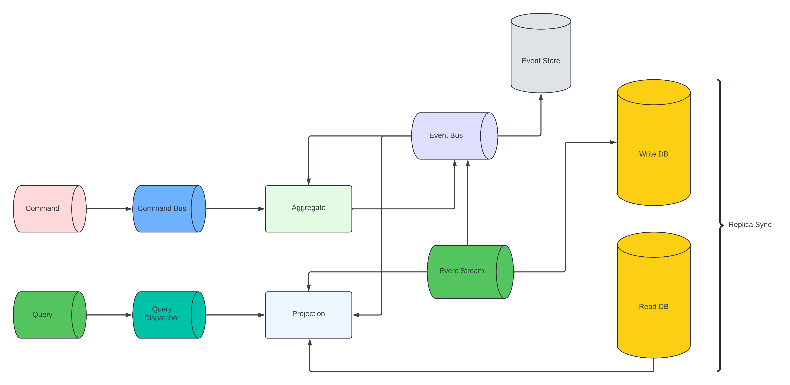
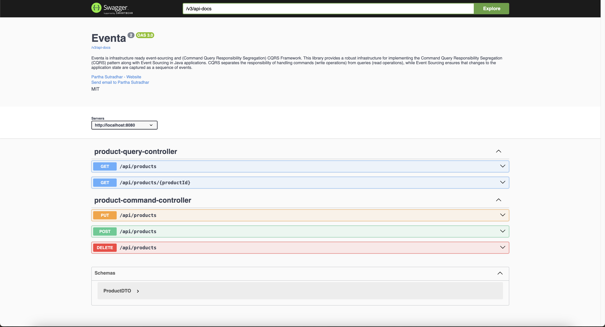

[](https://jitpack.io/#zaxxio/spring-boot-starter-eventa)

# Eventa (Infrastructure Ready Event-Sourcing and CQRS)
## Overview

This library provides a robust infrastructure for implementing the Command Query Responsibility Segregation (CQRS) pattern along with Event Sourcing in Java applications. CQRS separates the responsibility of handling commands (write operations) from queries (read operations), while Event Sourcing ensures that changes to the application state are captured as a sequence of events.

## Key Features

- **Command Handling:** Easily define command handlers to process incoming commands for creating, updating, or deleting domain entities.
- **Event Sourcing:** Implement event sourcing to persist and replay domain events, ensuring a full audit trail of state changes.
- **Aggregate Root Support:** Simplify the management of domain aggregates with built-in support for Aggregate Roots.
- **Annotation-Based Configuration:** Configure command handlers and event sourcing using annotations, reducing boilerplate code and promoting clean architecture.
- **Scalable and Extensible:** Designed to scale with the complexity of the application and easily extend functionality with custom components.
- **Asynchronous Processing:** Support for asynchronous processing of commands and events for improved performance and responsiveness.

## Usage
1. **Define Commands and Events:** Create classes to represent commands and events that encapsulate changes to domain entities.
2. **Implement Command Handlers:** Define command handler methods to process incoming commands and update the state of aggregates.
3. **Apply Event Sourcing:** Utilize event sourcing to persist domain events and rebuild aggregate state from event streams.
4. **Configure Infrastructure:** Set up infrastructure components such as command buses, event stores, and event processors to manage command and event handling.
5. **Integrate with Application:** Integrate the library with your application to leverage its CQRS and Event-Sourcing capabilities seamlessly.

# Architecture



# Endpoint


## Sample Aggregate

```java
@Aggregate
@NoArgsConstructor
@AggregateSnapshot(interval = 2)
public class ProductAggregate extends AggregateRoot {

    @RoutingKey
    private UUID id;
    private String productName;
    private double quantity;
    private double price;

    @CommandHandler(constructor = true)
    public void handle(CreateProductCommand createProductCommand) {
        apply(
                ProductCreatedEvent.builder()
                        .id(createProductCommand.getId())
                        .productName(createProductCommand.getProductName())
                        .quantity(createProductCommand.getQuantity())
                        .price(createProductCommand.getPrice())
                        .build()
        );
    }

    @EventSourcingHandler
    public void on(ProductCreatedEvent productCreatedEvent) {
        this.productName = productCreatedEvent.getProductName();
        this.price = productCreatedEvent.getPrice();
        this.quantity += 1;
    }

    @CommandHandler
    public void handle(UpdateProductCommand updateProductCommand) {
        apply(
                ProductUpdatedEvent.builder()
                        .id(updateProductCommand.getId())
                        .productName(updateProductCommand.getProductName())
                        .quantity(updateProductCommand.getQuantity())
                        .price(updateProductCommand.getPrice())
                        .build()
        );
    }

    @EventSourcingHandler
    public void on(ProductUpdatedEvent productUpdatedEvent) {
        this.productName = productUpdatedEvent.getProductName();
        this.price = productUpdatedEvent.getPrice();
        this.quantity = productUpdatedEvent.getQuantity();
    }

    @CommandHandler
    public void handle(DeleteProductCommand deleteProductCommand) {
        apply(
                ProductDeletedEvent.builder()
                        .id(deleteProductCommand.getId())
                        .productName(deleteProductCommand.getProductName())
                        .price(deleteProductCommand.getPrice())
                        .quantity(deleteProductCommand.getQuantity())
                        .build()
        );
    }

    @EventSourcingHandler
    public void on(ProductDeletedEvent productDeletedEvent) {
        this.productName = productDeletedEvent.getProductName();
        this.price = productDeletedEvent.getPrice();
        this.quantity = productDeletedEvent.getQuantity();
    }

}

```
## Sample Projection Group
```java
@Log4j2
@Service
@ProjectionGroup
@RequiredArgsConstructor
public class ProductProjection {

    private final ProductRepository productRepository;

    @EventHandler(ProductCreatedEvent.class)
    @Transactional(transactionManager = "transactionManager")
    public void on(ProductCreatedEvent productCreatedEvent) {
        log.info("Product Created {}", productCreatedEvent);

        Product product = new Product();
        product.setId(productCreatedEvent.getId());
        product.setProductName(productCreatedEvent.getProductName());
        product.setQuantity(productCreatedEvent.getQuantity());
        product.setPrice(productCreatedEvent.getPrice());
        Product persistedProduct = productRepository.save(product);
        log.info("Persisted Product : {}", persistedProduct);

        printThreadId();
    }

    @EventHandler(ProductUpdatedEvent.class)
    @Transactional(transactionManager = "transactionManager")
    public void on(ProductUpdatedEvent productUpdatedEvent) {
        log.info("Product Updated {}", productUpdatedEvent);

        Optional<Product> optionalProduct = productRepository.findById(productUpdatedEvent.getId());

        if (optionalProduct.isPresent()) {
            Product product = optionalProduct.get();
            product.setProductName(productUpdatedEvent.getProductName());
            product.setQuantity(productUpdatedEvent.getQuantity());
            product.setPrice(productUpdatedEvent.getPrice());
            Product persistedProduct = productRepository.save(product);
            log.info("Updated Product : {}", persistedProduct);
        }

        printThreadId();
    }


    @EventHandler(ProductDeletedEvent.class)
    @Transactional(transactionManager = "transactionManager")
    public void on(ProductDeletedEvent productDeletedEvent) {
        this.productRepository.deleteById(productDeletedEvent.getId());
        log.info("Product Deleted : {}", productDeletedEvent.getId());
        printThreadId();
    }

    private static void printThreadId() {
        log.info("Thread Id : {}", Thread.currentThread().getId());
    }


    @QueryHandler
    @Transactional(transactionManager = "transactionManager")
    public Product handle(FindByProductIdQuery findByProductIdQuery) {
        Optional<Product> optionalProduct = productRepository.findById(findByProductIdQuery.getProductId());
        return optionalProduct.orElse(null);
    }

    @QueryHandler
    @Transactional(transactionManager = "transactionManager")
    public List<Product> handle(FindAllProducts products) {
        return productRepository.findAll();
    }

}
```
##  Command Dispatcher
```java

@RestController
@RequestMapping("/api/products")
@RequiredArgsConstructor
public class ProductCommandController {

    private final CommandDispatcher commandDispatcher;

    @PostMapping
    public ResponseEntity<?> createProduct(@RequestBody List<ProductDTO> productDTOS) throws Exception {

        final List<String> processed = new ArrayList<>();
        for (ProductDTO productDTO : productDTOS) {
            final CreateProductCommand createProductCommand = CreateProductCommand.builder()
                    .id(UUID.randomUUID())
                    .productName(productDTO.getProductName())
                    .quantity(productDTO.getQuantity())
                    .price(productDTO.getPrice())
                    .build();
            String id = this.commandDispatcher.send(createProductCommand);
            processed.add(id);
        }

        return ResponseEntity.ok(processed);
    }


    @PutMapping
    public ResponseEntity<?> updateProduct(@RequestBody List<ProductDTO> productDTOS) throws Exception {
        for (ProductDTO productDTO : productDTOS) {
            final UpdateProductCommand updateProductCommand = UpdateProductCommand.builder()
                    .id(productDTO.getId())
                    .productName(productDTO.getProductName())
                    .quantity(productDTO.getQuantity())
                    .price(productDTO.getPrice())
                    .build();
            this.commandDispatcher.send(updateProductCommand);
        }
        return ResponseEntity.ok("");
    }

    @DeleteMapping
    public ResponseEntity<?> deleteProduct(@RequestBody List<ProductDTO> productDTOS) throws Exception {
        for (ProductDTO productDTO : productDTOS) {
            final DeleteProductCommand deleteProductCommand = DeleteProductCommand.builder()
                    .id(productDTO.getId())
                    .productName(productDTO.getProductName())
                    .quantity(productDTO.getQuantity())
                    .price(productDTO.getPrice())
                    .build();

            this.commandDispatcher.send(deleteProductCommand);
        }
        return ResponseEntity.ok("");
    }

}
```

## Query Dispatcher

```java
@RestController
@RequestMapping("/api/products")
@RequiredArgsConstructor
public class QueryCommandHandler {

    private final QueryDispatcher queryDispatcher;

    @GetMapping("/{productId}")
    @ResponseStatus(HttpStatus.OK)
    public ResponseEntity<?> getProductById(@PathVariable("productId") UUID productId) {
        final FindByProductIdQuery findByProductIdQuery = FindByProductIdQuery.builder()
                .productId(productId)
                .build();
        final Product result = queryDispatcher.dispatch(findByProductIdQuery, ResponseType.instanceOf(Product.class));
        return ResponseEntity.ok(result);
    }

    @GetMapping
    @ResponseStatus(HttpStatus.OK)
    public ResponseEntity<?> getProducts() {
        final FindAllProducts findAllProducts = FindAllProducts.builder().build();
        final List<Product> products = queryDispatcher.dispatch(findAllProducts, ResponseType.multipleInstancesOf(Product.class));
        return ResponseEntity.ok(products);
    }

}

```
## Interceptor 
```java
@Component
public class ProductCommandInterceptor implements CommandInterceptor {

    @Override
    public void preHandle(BaseCommand command) {
        if (command instanceof CreateProductCommand) {
            // change or logical processing pre-processing
        }
    }

    @Override
    public void postHandle(BaseCommand command) {
        if (command instanceof  CreateProductCommand) {
            // change or logical processing post-processing
        }
    }
}

@Configuration
public class EventaConfig {

    @Autowired
    private ProductCommandInterceptor productCommandInterceptor;

    @Bean
    public CommandInterceptorRegisterer commandInterceptorRegisterer() {
        CommandInterceptorRegisterer commandInterceptorRegisterer = new CommandInterceptorRegisterer();
        commandInterceptorRegisterer.register(productCommandInterceptor);
        return commandInterceptorRegisterer;
    }

}   

```
## Infrastructure Dependency
```yaml
eventa:
  kafka:
    bootstrap-servers: localhost:9092
    trusted-packages:
    event-store-name: BaseEvent
  mongodb:
    username: username
    password: password
    port: 27017
    host: localhost
    database: events_store
    authentication-database: admin
    
spring:
  application:
    name: spring-boot-app
  # Kafka Bootstrap Server's
  kafka:
    bootstrap-servers: localhost:9092
    producer:
      key-serializer: org.apache.kafka.common.serialization.UUIDSerializer
      value-serializer: org.springframework.kafka.support.serializer.JsonSerializer
    consumer:
      group-id: eventa-consumer-group
      auto-offset-reset: earliest
      key-deserializer: org.apache.kafka.common.serialization.UUIDDeserializer
      value-deserializer: org.springframework.kafka.support.serializer.JsonDeserializer
      properties:
        spring:
          json:
            trusted:
              packages: '*'
    listener:
      missing-topics-fatal: false
      ack-mode: manual
  # Mongo DB
  data:
    mongodb:
      repositories:
        type: imperative
      authentication-database: admin
      auto-index-creation: true
      database: eventstore
      username: username
      password: password
      port: 27017
      host: localhost
```

## Copyright 
```text
Copyright 2024 Partha Sutradhar

Permission is hereby granted, free of charge, to any person obtaining a copy of this software and associated documentation files (the "Software"), to deal in the Software without restriction, including without limitation the rights to use, copy, modify, merge, publish, distribute, sublicense, and/or sell copies of the Software, and to permit persons to whom the Software is furnished to do so, subject to the following conditions:

The above copyright notice and this permission notice shall be included in all copies or substantial portions of the Software.

THE SOFTWARE IS PROVIDED "AS IS", WITHOUT WARRANTY OF ANY KIND, EXPRESS OR IMPLIED, INCLUDING BUT NOT LIMITED TO THE WARRANTIES OF MERCHANTABILITY, FITNESS FOR A PARTICULAR PURPOSE AND NONINFRINGEMENT. IN NO EVENT SHALL THE AUTHORS OR COPYRIGHT HOLDERS BE LIABLE FOR ANY CLAIM, DAMAGES OR OTHER LIABILITY, WHETHER IN AN ACTION OF CONTRACT, TORT OR OTHERWISE, ARISING FROM, OUT OF OR IN CONNECTION WITH THE SOFTWARE OR THE USE OR OTHER DEALINGS IN THE SOFTWARE.
```
